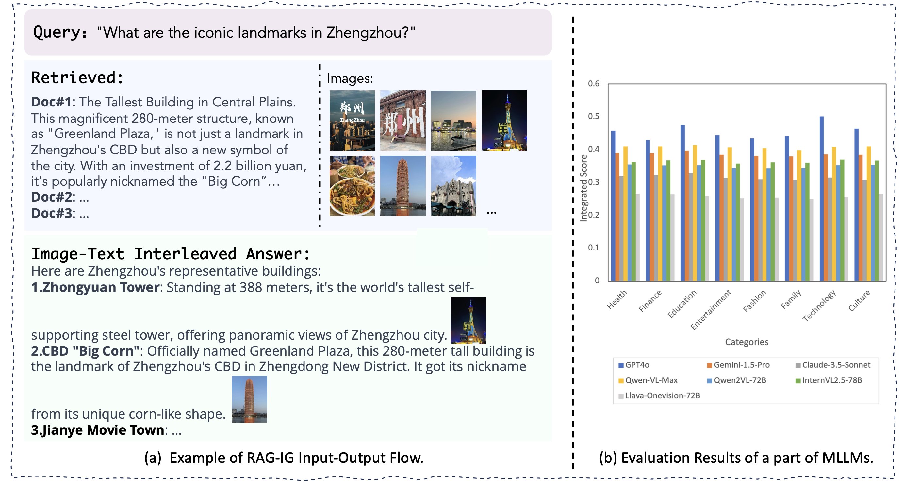
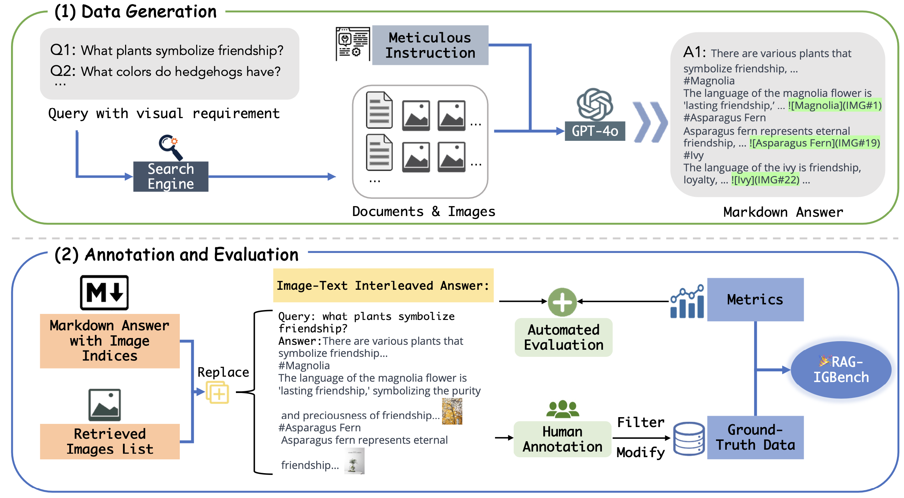
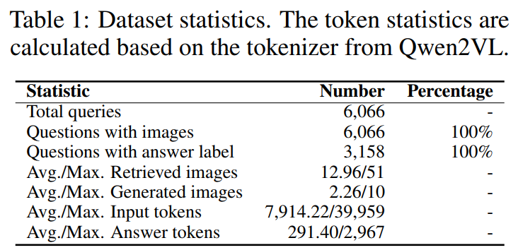
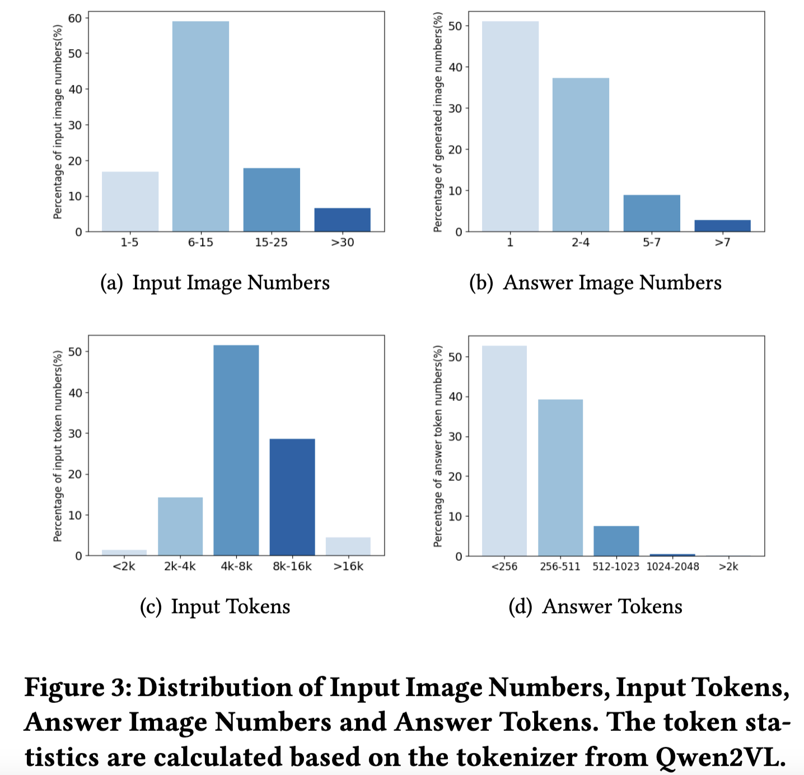

# RAG-IGBench: Innovative Evaluation for RAG-based Interleaved Generation in Open-domain Question Answering

📖[Paper]() | 🤗[Huggingface]()

In real-world scenarios, providing user queries with visually enhanced responses can considerably benefit understanding and memory, underscoring the great value of interleaved image-text generation. 

Therefore, we present **Interleaved Generation** based on **Retrieval-Augmented Generation** (RAG-IG) and the corresponding **RAG-IGBench**, a thorough benchmark designed specifically to evaluate the task. By integrating MLLMs with the RAG paradigm, we achieve high-quality and semantically coherent image-text interleaved generation.

<div align=center></div>

<div align=center></div>

The two figures above illustrate the RAG-IG pipeline and a representative portion of our experimental results. Specifically, we input the query along with retrieved documents and images into the MLLMs. Through detailed instructions, the MLLMs generate answers in markdown format, incorporating appropriate image indices. Subsequently, we replace these image indices with the corresponding images to produce the final output: a coherent answer where text and images are seamlessly interleaved.

To comprehensively evaluate diverse MLLMs on RAG-IG, we use metrics of three dimensions: text quality, image quality, and image-text consistency. We use ROUGE-1 for text quality evaluation, modified Edit Distance and Kendall Score for image quality evaluation, and CLIP Score and Alignment Score for image-text consistency evaluation. The details of our innovative metrics can be found in our paper.

The following two figures show the statistics of our RAG-IGBench:

<div align=center></div>

<div align=center></div>


## 📚 Setup
We have hosted the RAG-IGBench dataset on Huggingface. The format of each line in `data.jsonl` is:
```
[
    {
        "id": "a number",
        "query": "user question",
        "documents": [
            "content of doc#1",
            "content of doc#2",
            ...
        ],
        "images":[
            [id/1/IMG#1, id/1/IMG#2, ...],     # images of doc#1
            [id/2/IMG#x, id/2/IMG#x+1, ...],      # images of doc#2
            ...
        ],
        "gt_answer": "answer str",
        "category":[
            "Finance",      # topic of the query
            "what-is"       # one of "what-is", "how-to", "yes-or-no" and "head-to-head"
        ]
    }
]
```
Run the script `download.py' to get all the images. The images folder structure is:
```
INPUT_DIR
    |INPUT_FILE(data.json)
    |images
        |1                              # images folder for query 1
            |1                              # images folder for doc#1
                |IMG#1.jpg
                |IMG#2.jpg
                |...
            |2                              # images folder for doc#2
                |IMG#x.jpg
                |...
            |3                              # images folder for doc#3
        |2                              # images folder for query 2
            |...
        |3                              # images folder for query 3
            |...
        |..
```
## 🛠️ Usage
### Answer generation
We have to modify the inference code for various models to support interleaved multi-images inputs. We have prepared some testing scripts for currently available open-source and closed-source models in the `./model_generation` folder. The models we support now include **GPT4o**, **Claude**, **Gemini**, **LLaVa-OV**, **InternVL2.5**, **Qwen2/2.5VL**, **NVLM_D** and **Deepseekvl2**. For the evaluation of these models, you only need to modify the model's path and the path to RAG-IGbench's dataset to generate answers. The test result will be saved in a JSONL file.
### Evaluation
Use the `./eval.py` script to score the model's responses. What you need to provide is:
```
output_file = ''              # Save the evaluation result
input_file = ''               # Model answer file
clip_model_path = ''          # The model used to calculate Clip-Score, default as CLIP-ViT-Large-Patch14 from OpenAi
embedding_model_path = ''     # The model used to calculate Alignment-Score, default as Conan-embedding
```
Finally, the evaluation result will be saved in a JSONL file and the final scores will be printed in stdout, or you can run `./scores.py` with evaluation result file as input to get the final scores.

## ✒️Citation

## 📄 License
 

Usage and License Notices: The data and code are intended and licensed for research use only. License: Attribution-NonCommercial 4.0 International It should abide by the policy of OpenAI: https://openai.com/policies/terms-of-use
